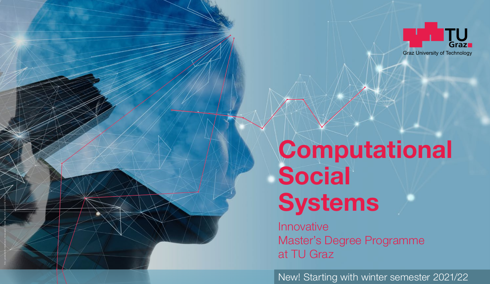
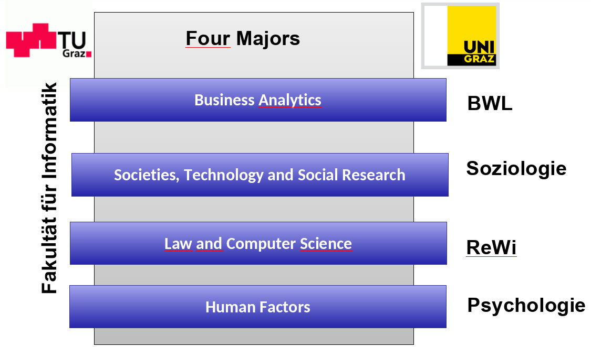
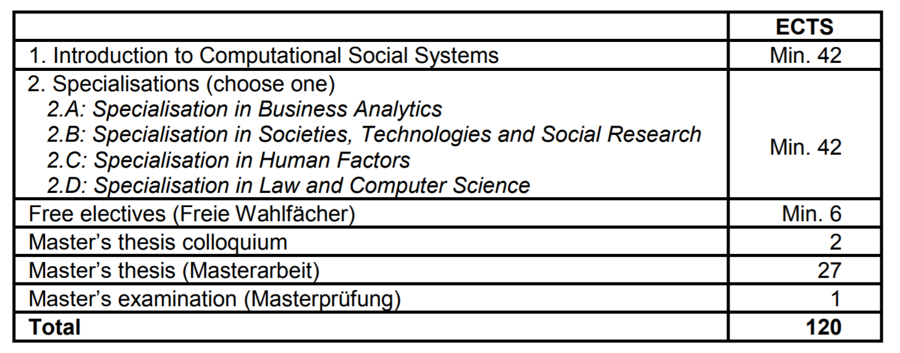

```{r xaringan-themer, include=FALSE, warning=FALSE}
#This block contains the theme configuration for the CSS lab slides style
library(xaringanthemer)
library(showtext)
style_mono_accent(
  base_color = "#5c5c5c",
  text_font_size = "1.5rem",
  header_font_google = google_font("Arial"),
  text_font_google   = google_font("Arial", "300", "300i"),
  code_font_google   = google_font("Fira Mono")
)
```

```{r setup, include=FALSE}
options(htmltools.dir.version = FALSE)
```


layout: true
<div class="my-footer"><span>David Garcia - Computational Social Systems Master's Programme - ISDS, TU Graz</span></div> 


---
class:center
# About me

.pull-left[
```{r, echo=FALSE, out.width=270}
knitr::include_graphics("figures/Profile.jpg")
```
]

.pull-right[
<br>
Website: [dgarcia.eu](https://dgarcia.eu)

Twitter: [@dgarcia_eu](https://twitter.com/dgarcia_eu)

Github: [dgarcia-eu](https://github.com/dgarcia-eu)

Email: garcia@csh.ac.at
]

Professor for Computational Behavioral and Social Sciences at TU Graz
<br>Faculty member of the Complexity Science Hub Vienna
<br>Group leader at the Medical University of Vienna
<br>Privatdozent at ETH Zurich, teaching Social Data Science

---

```{r, echo=FALSE, out.width=1050, fig.align='center'}

```

---

# Aims

**Acquire skills to understand the digital society and to seize the opportunities brought by the digital transformation.**

```{r, echo=FALSE, out.width=1100, fig.align='center'}

```

---
# Specialization tracks

```{r, echo=FALSE, out.width=850, fig.align='center'}

```


---

# Curriculum Structure

```{r, echo=FALSE, out.width=1150, fig.align='center'}

```

---

# Apply now!

```{r, echo=FALSE, out.width=900, fig.align='center'}

```
**More information at: [tugraz.at/go/master-css](tugraz.at/go/master-css)**
